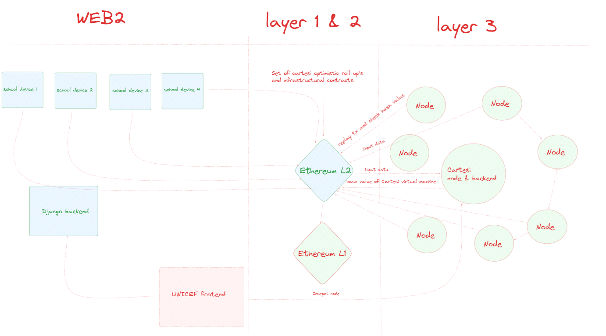

# The Witness: UNICEF data protection network

# Bringing on-chain security off-chain

Author: Ilija Petronijevic

Email: ilijapet@gmail.com

Project Summary

Main goal of this project is to bring the power of blockchain and cryptography to the world of schools and in this way ensure data integrity about internet usage.

In most general terms, the current state of affairs reveals that data on devices are primarily safeguarded by promises made by device producers and, at best, by policy documents, rather than by robust data protection technologies. The frequency of these promises being broken has led us to recognize the necessity for a novel approach in addressing the issue of device data integrity. Here we are proposing a new solution that places greater emphasis on cryptographic and blockchain guarantees to establish and ensure user trust in date. As devices around us proliferate and become increasingly integrated in our everyday life ensuring the integrity and reliability of the data they contain, on which we base our everyday decisions, becomes paramount. This project intends to demonstrate how blockchain and cryptography can address some of those challenges.

Cartesi unique value proposition: we believe that using the Cartesi backend will allow us to have more complex data processing capabilities compared to what is currently available within EVM framework. In scenarios where we feed huge amounts of data generated by devices all around the world into UNICEF dapp backend when using Cartesi we don't need to think within constrains of EVM and traditional smart contracts. It give us more freedom and flexibility by relaying on mature ecosystem of traditional general purpose languages like Python or JavaScript as well as linux native tools. Leveraging power of smart contracts deployed on Ethereum in combination with Cartesi nodes we can achieve huge processing power, blockchain level data integrity for near zero transactional cost. With this proposal we would like, in broad strokes , to demonstrate how this can be done.

IMPORTANT: For developers who didn't have previous exposure to Cartesi tech stack it can be useful to look at this page [cartesi architecture](https://docs.cartesi.io/cartesi-rollups/1.5/core-concepts/architecture/) It explains how all elements fits together. Because Cartesi architecture is diverging from the typical EVM based architectures that we used to work on Ethereum L1's or optimistic and zk L2's.

Scope & Methodology:

We will develop small front-end, Django backend and Cartesi dapp backend for ingestion of data coming from huge number of school devices located all around the globe.

Here are description of basic data flow:

1. On the Django backend we will mock data from schools communication device (in real world scenario this will come from computer connected to device or device itself)

2. Submit this data to Django `bridge` app, through which data get's submited to `inputBox` Cartesi contract (kind of gateway to UNICEF-Cartesi dapp backend)

3. Cartesi roll-up node listen for submitted tx data, receives data and submit back to Cartesi dapp backend for further data processing

4. Cratesi dapp backend receive encrypted data; confirms that data are coming for valid school device (via basic asymmetric key cryptography) and decrypt data back into plain text (Python dict)

5. If everything goes well Cartesi dapp backend will now process and record new entry into database about device performance

6. After few transaction circles (Cartesi epoch) whole state of Cartesi machine will be recorded back via set of optimistic roll app contracts for other Cartesi nodes from UNICEF network to be able to challenge submitted hash valued

7. If all nodes in Cartes/UNICEF network of nodes confirm that they get same hash value by replaying transaction inputs in their local environments, new state of machine will be recognized as final and whole process can be repeated with new incoming data from network of school devices

8. From the user perspective (or admin perspective), via React app he can query Cartesi backend for data related to specific school or device

Inside this project we will build 3 basic components:

1. Cartesi Dapp backend for processing inputs and maintaining state of the connected devices from the schools

2. Django REST backend which will receive data inputs from school devices, sign transaction and submit to blockchain (and then via blockchain further to Cartesi Dappp backend). This Django REST backend will also be used to serve

3. React frontend with classical web2 staff (authentication etc.)

4. Then we will build mock school devices to be used to generate data (acting like schools in real life scenarios) and feed that data into Cartesi dapp backend.

NOTICE: currently school device are mocked by data generator implemented as Django app. In more realistic scenarios each school will communicate directly to smart contracts by submitting device usage and performance monitoring data to Cartesi dapp backend.

Basic underlying cryptographic protocol

We want to ensure following characteristics of communication between 3 elements: school device (local computer submitting data), Django Backend and Cartesi backend:

1. School Device > Django backend relation: In this relation we should preserve confidentiality, data integrity and authenticity. Django should not be able to see raw data as well as not to be able to temper with received data (in real world scenario this data would be submitted directly to smart contract from school computer or device)

2. Django backend > Cartesi backend relation: Django is used here just to submit and pay for transaction coming from mocked device (this can well be done as simple Python script talking directly to Cartesi smart contracts - acting as client)

3. Cartesi backend - School device relation: Lastly we have authenticity, confidentiality and integrity between school device and Cartesi dapp backend. We need to know that the message originates from an school device which is part of our data protection network (authenticity), that the message is in integral form (integrity) and that data is in encrypted form (confidentiality).

To achieved this described properties we will implement following steps:

Generate public-private key pairs for school device and Catesi dapp backend.

Store public key from school device on Cartesi server and associate with school device ID.

Store public key of Cartesi dapp backend server on school device for encryption purpose.

Write flow: school device perspective

School device (local computer) generate data (school ID, timestamp, download/upload speeds, latency) and encrypt with Cartesi backend public key to preserve confidentiality of original data while passing through Django backend or generally public internet.

Sign encrypted data with school device private keys. Send encrypted message and digital signature to Django backend

Django backend

Django backend receive encrypted message and digital signature from school device. Submit tx and send encrypted message and school device signature to Cartesi backend via `inputBox` contract.

Cartesi backend

Cartesi backend receive encrypted message and signature. Cartesi dapp backend verify via signature and school public key that message is indeed coming from school device which is member of UNICEF data protection network. If that’s ok, then it takes an encrypted message and its own private key and decrypts the message getting in return plain school device metric data (school ID, timestamp, download/upload speeds and latency). In last step update state in database related to that school device and do some data analytics (if necessary).

Here on this point I would like ones again to point out potential advantage of Cartesi architecture compared to classical EVM's. With Cartesi we can use which every Python, JavaScript or Linux library we need for data processing. While in context of EVM we need to operate within constrains of EVM compatible languages.

Here are general overview of architecture:

Tech stack for this phase of project will be: React frontend, Django REST web2 backend, web3.py, Cartesi tech stack, Github. Git and supporting Python cryptographic and other libraries (pycryptodome, crypto or similar).

## How to run and test The Witness dapp locally on your machine?

You need to have on your machine Python, Cartesi CLI, Yarn and Docker. Beside this you will need to run following steps:

1. `git clone https://github.com/ilijapet/The_Witness_UNICEF_blockchain_based_school_connectivity_data_protection_system`

2. Install Cartesi command line tool `npm install -g @cartesi/cli` For more informations [Cartesi architecture](https://docs.cartesi.io/cartesi-rollups/1.3/development/installation/)

3. cd into `cartesi_backend`

4. `python -m venv .venv && source .venv/bin/activate` And then `pip install -r requirements.txt`

5. Add `.env` file to `cartesi_frontend` and to `cartesi_backend`. Then add `.env_dev` to backend

6. Run Docker engine in background (as desktop or from command line)

7. run `cartesi build` and then `cartesi run`. Ones you type `cartesi run` you need to wait first time few minutes. Every next time Cartesi backend will be run immediately.

8. Open separate terminal and cd into `backend` folder

9. Run `python -m venv .venv && source .venv/bin/activate`

10. `pip install -r requirements.txt` and then `python -m manage runserver 8005`

11. cd into `cartesi_frontend` and run `yarn install` and then `yarn run dev` for React frontend server

12. Then you can just go to The Witness frontend via `http://localhost:8081/` and login in with test email `ilijapet@gmail.com` with test password `123456789`

At this point you will be able to monitor basic school communication device performance generated via our mock script in Django backend and passed through set of Cartesi contracts and then to our Cartesi dapp backend.

Video walkthrough can be found here 
